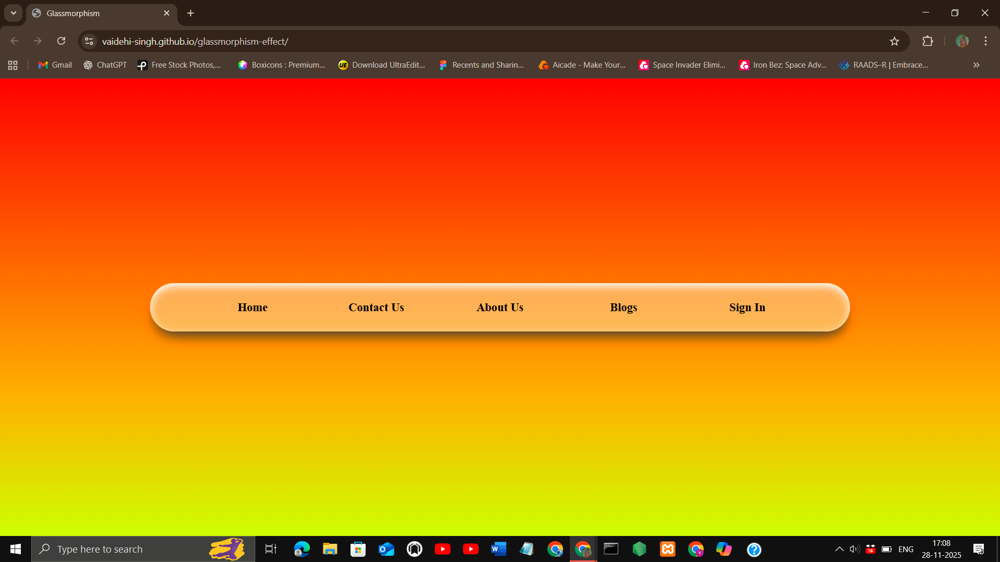
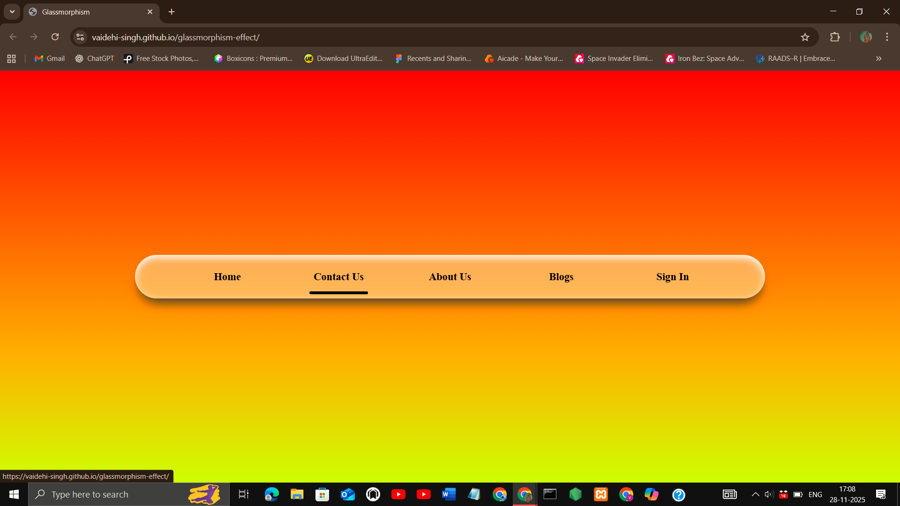

## Project Title
Glassmorphism Effect

## Description
A glassmorphism navbar designed with a frosted blur effect and smooth transitions, set against a vibrant red‑to‑yellow linear gradient background. The design combines modern aesthetics with responsive behavior, offering a sleek navigation experience that highlights active states and adapts gracefully to different screen sizes.

## Features
- Responsive design (mobile, tablet, desktop)
- Smooth animations
- Clean, modern UI
- Interactive hover effects

## Demo
[Live Demo](https://vaidehi-singh.github.io/glassmorphism-effect/)

## Screenshots



## Tech Stack
- HTML
- CSS
- JavaScript

## How to Use
 1. Clone the repo  
   ```bash
   git clone https://github.com/vaidehi-singh/glassmorphism-effect.git
   cd glassmorphism-effect
   ```
 2. Open index.html in your browser.

## Author
Designed and developed by **Vaidehi Singh**  
[GitHub Profile](https://github.com/vaidehi-singh)
